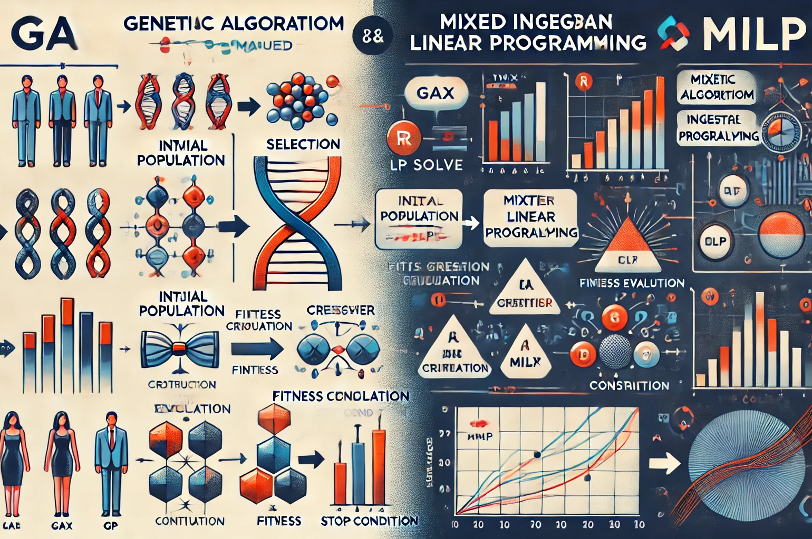

## What we will learn:

### 1. Overview of GA and MILP

Genetic Algorithms (GA) and Mixed-Integer Linear Programming (MILP) are powerful optimization techniques widely used in fields like logistics, finance, and engineering. GA mimics natural selection to solve complex problems, offering flexibility and effectiveness in avoiding local optima. In contrast, MILP focuses on optimizing linear objectives while adhering to specific constraints, ensuring precise solutions for well-defined issues.

### 2. Real-Life Applications

Both GA and MILP are beneficial for a range of real-life applications, such as scheduling, routing, and resource allocation. GA is particularly useful in complex scenarios where traditional methods may falter, while MILP excels in situations requiring structured, precise decision-making, such as supply chain management and financial portfolio optimization.

## Practice in R

Implementing these techniques in R is straightforward with packages like `GA` for genetic algorithms and `ompr` for MILP. This accessibility enables users to tackle complex optimization challenges efficiently, empowering them to make informed, data-driven decisions in various practical scenarios.

